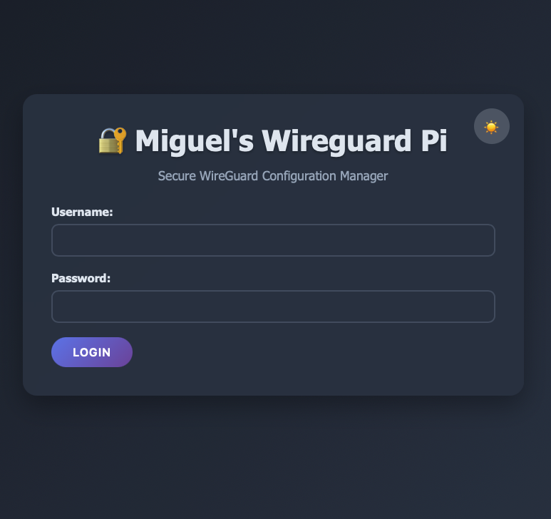
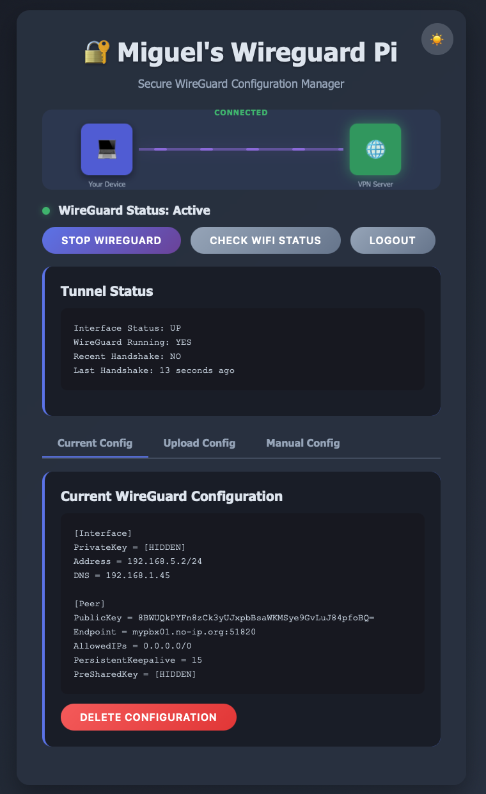
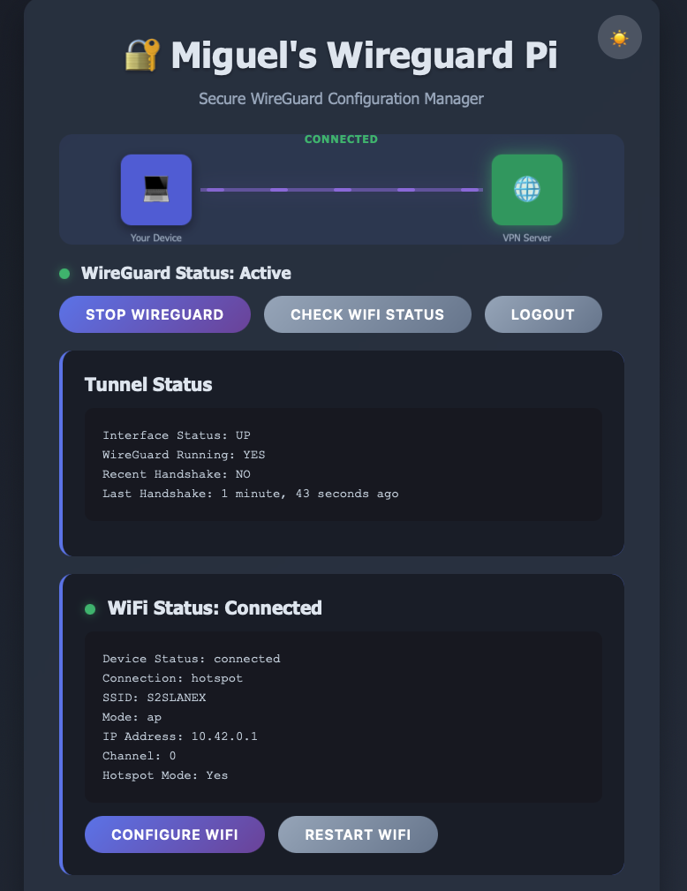
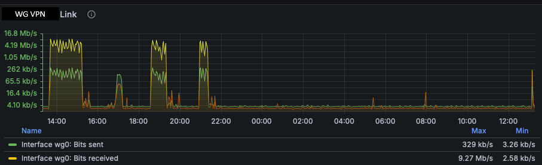

# Miguel's Wireguard Pi

## Project Overview

This is a comprehensive network management web application written in PHP with a client-side JavaScript interface. The application provides a secure web-based interface for managing both WireGuard VPN configurations and WiFi hotspot settings on a Raspberry Pi. It combines VPN service control with WiFi access point management in a unified interface.

## Screenshots

### Login Screen

### Main Menu

### WiFi Management

## Monitoring Integration

The application includes comprehensive monitoring capabilities for network services:

### Zabbix & Grafana Monitoring

The system integrates with Zabbix for monitoring WireGuard VPN status and performance metrics, with Grafana dashboards providing visual monitoring of:
- VPN connection status and handshake monitoring
- Network throughput and latency metrics
- System health and connectivity statistics
- Real-time alerting for service interruptions

## Common Development Commands

### User Management
- Create user: `php manage_users.php create <username> <password>`
- Update password: `php manage_users.php update <username> <new_password>`
- List users: `php manage_users.php list`
- Activate/deactivate user: `php manage_users.php activate/deactivate <username>`
- Delete user: `php manage_users.php delete <username>`

### System Commands (require sudo privileges)

#### WireGuard VPN Management
- Start WireGuard: `sudo wg-quick up wg0`
- Stop WireGuard: `sudo wg-quick down wg0`
- Check WireGuard status: `sudo wg show wg0`
- Check interface status: `ip link show wg0`

#### WireGuard Monitoring Service
- Install monitoring service: `sudo ./install_wg_monitor.sh`
- Start monitoring service: `sudo systemctl start wg0-monitor`
- Stop monitoring service: `sudo systemctl stop wg0-monitor`
- Check monitoring status: `sudo systemctl status wg0-monitor`
- View monitoring logs: `sudo journalctl -u wg0-monitor -f`
- View log file: `sudo tail -f /var/log/wg0_monitor.log`

#### WiFi Hotspot Management
- Check WiFi device status: `sudo nmcli device status | grep wlan0`
- Show current connections: `sudo nmcli connection show`
- Create hotspot: `sudo nmcli connection add type wifi ifname wlan0 con-name hotspot autoconnect yes ssid <SSID>`
- Configure AP mode: `sudo nmcli connection modify hotspot 802-11-wireless.mode ap`
- Set hotspot password: `sudo nmcli connection modify hotspot 802-11-wireless-security.psk <password>`
- Restart WiFi connection: `sudo nmcli connection down <connection> && sudo nmcli connection up <connection>`

### Web Server
This application runs on a standard PHP web server. The working directory `/var/www/html` suggests it's designed for Apache with PHP.

## Architecture and Code Organization

### Authentication System
- Session-based authentication with rate limiting
- User credentials stored in `users.json` with bcrypt password hashing
- Rate limiting implemented per IP address (5 attempts per 15 minutes)
- Session timeout set to 30 minutes

### File Structure
- `index.html` - Main single-page application with embedded CSS/JS
- `login.php` - Authentication endpoint with rate limiting
- `logout.php` - Session termination
- `check_session.php` - Session validation endpoint
- `manage_users.php` - CLI user management script
- `users.json` - User database (JSON format)
- `install_wg_monitor.sh` - WireGuard monitoring service installation script
- `api/` - REST API endpoints:
  - `status.php` - WireGuard status checking
  - `toggle.php` - Start/stop WireGuard service
  - `save_config.php` - Save WireGuard configurations (authenticated)
  - `load_config.php` - Load current configuration
  - `wifi_status.php` - WiFi connection status monitoring
  - `wifi_config.php` - WiFi hotspot configuration and management

### Security Features
- All API endpoints require authentication
- Input validation and sanitization
- Rate limiting on login attempts
- Session management with timeouts
- Password hashing with bcrypt
- Command injection prevention in system calls
- File permissions restricted on user database

### Network Service Integration

#### WireGuard VPN
- Configuration stored in `/etc/wireguard/wg0.conf`
- Uses `wg-quick` commands for service management
- Real-time status monitoring including interface state and handshake status
- Support for configuration upload, manual entry, and file-based management
- Configuration validation prevents malformed configs
- Automated monitoring service that:
  - Continuously monitors wg0 interface status (every 2 minutes)
  - Automatically restarts WireGuard if the interface goes down
  - Reboots the system after 10 consecutive failed restart attempts
  - Logs all monitoring activities to `/var/log/wg0_monitor.log`
  - Runs as a systemd service with automatic startup on boot

#### WiFi Hotspot Management
- Uses NetworkManager (`nmcli`) for WiFi control (no hostapd dependency)
- Automatic AP (Access Point) mode configuration
- SSID validation (1-32 printable characters)
- WPA2-PSK security with password validation (8-63 characters)
- IP sharing configuration (10.42.0.0/24 network)
- Connection restart and status monitoring capabilities

### Frontend Features
- Dark/light theme toggle with localStorage persistence
- Real-time tunnel visualization with animations
- Tabbed interface for different configuration methods
- Responsive design for mobile devices
- Client-side session management and automatic logout
- WiFi status monitoring with visual indicators
- WiFi hotspot configuration modal interface
- Integrated network management (VPN + WiFi) in single interface

## Important Notes

### System Requirements
- This application requires sudo privileges for both WireGuard and WiFi management
- The web server user must be configured in sudoers for:
  - `wg-quick` and `wg` commands (WireGuard)
  - `nmcli` commands (NetworkManager/WiFi)
- NetworkManager must be installed and running for WiFi functionality
- No build process required - pure PHP/HTML/CSS/JS application

### Security Considerations
- User database file (`users.json`) has restricted permissions (0600)
- All network configuration endpoints require authentication
- WiFi passwords and WireGuard keys are hidden in the UI
- Configuration changes are logged with username for auditing
- Input validation prevents malformed network configurations

### Network Architecture
- Supports dual network management: VPN (WireGuard) + WiFi Hotspot
- WiFi hotspot operates in AP mode with shared IP addressing
- WireGuard VPN can operate independently of WiFi status
- Authentication state persists across page reloads via sessions